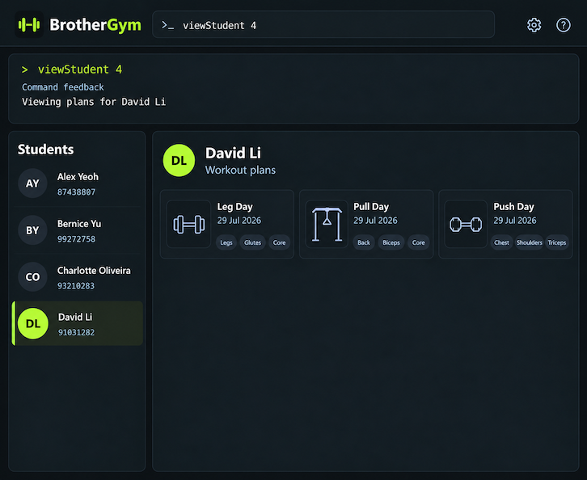

# BrotherGym
*A good bro to help busy gym trainers with student workout management*

 

## Contents
- [Overview](##overview)
- [Features](##features)
- [Getting Started](##getting-started)
- [Contribute](##contribute)
- [Authors](##authors)
- [Acknowledgements](##acknowledgements)

## Overview
**BrotherGym** helps gym trainers manage their students and allows them to plan and track the workouts of their students.
It is optimised for CLI users so that frequent tasks can be done faster by typing in commands.

## Features
BrotherGym primarily keeps track of the students and their workouts, 
with the following core functionalities

| Feature            | Description                                    |
|--------------------|------------------------------------------------|
| Student management | An easily accessible list of all students      |
| Workout management | A convenient list of workouts for each student | 

More information can be found in our [User Guide](https://ay2627s1-cs2103t-t11-4.github.io/tp/UserGuide.html#quick-start)

## Getting Started

### Prerequisites
- Java 25 or later 
  - For mac users, ensure you have the [precise JDK version](https://se-education.org/guides/tutorials/javaInstallationMac.html)

### Setup
1. Clone this project into your computer
2. Navigate to your local project root
3. Run BrotherGym with `./gradlew run`

## Contribute
See our [Developer Guide](https://ay2627s1-cs2103t-t11-4.github.io/tp/DeveloperGuide.html) for more details!

## Authors
Learn more about our team [here](https://ay2627s1-cs2103t-t11-4.github.io/tp/AboutUs.html)!

## Acknowledgements
This project is based on the [`AddressBook-Level3`](https://github.com/NUS-CS2103-AY2627-S1/tp) project 
created by the [SE-EDU initiative](https://se-education.org).
