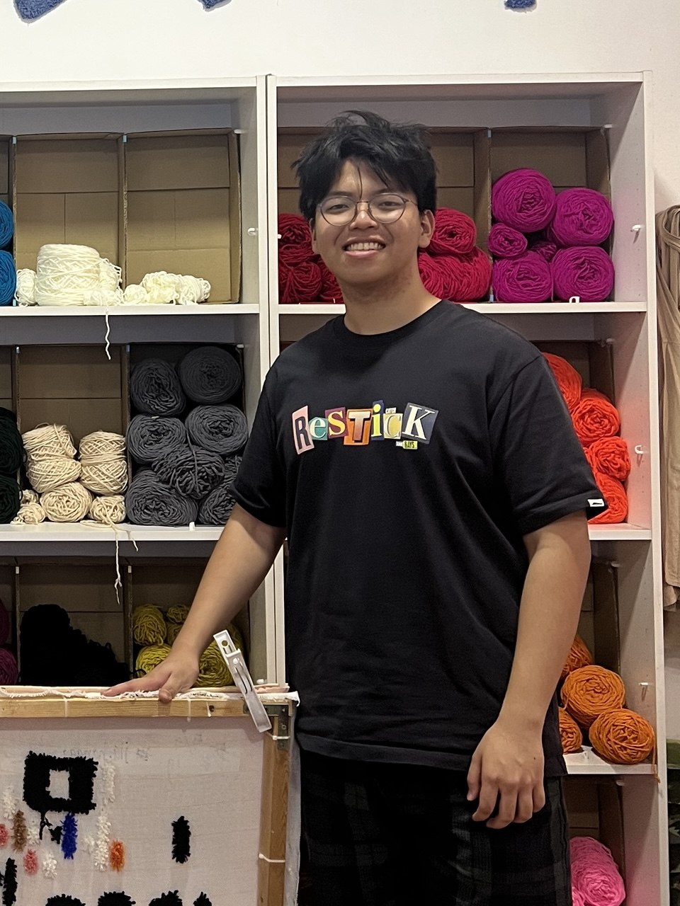
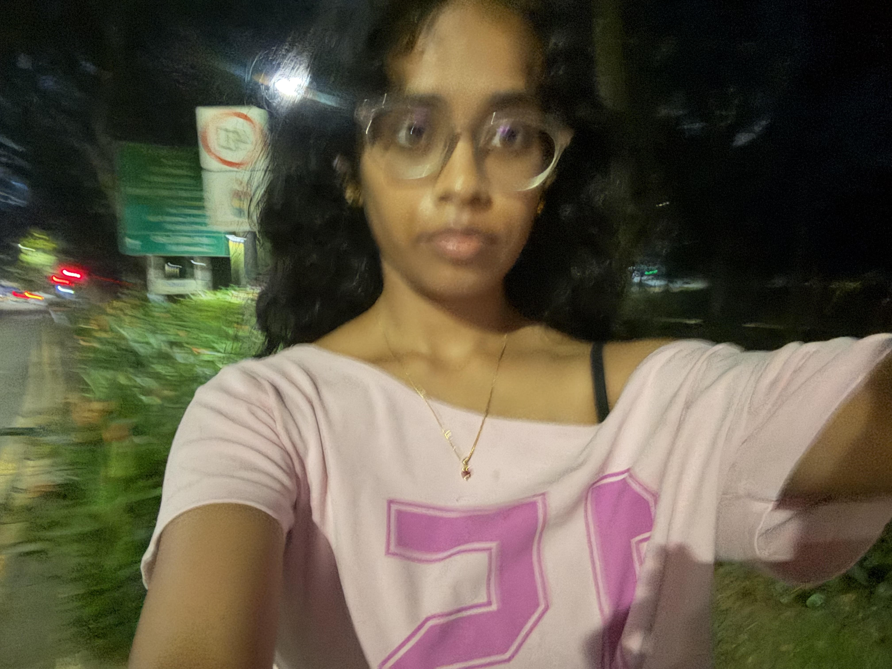
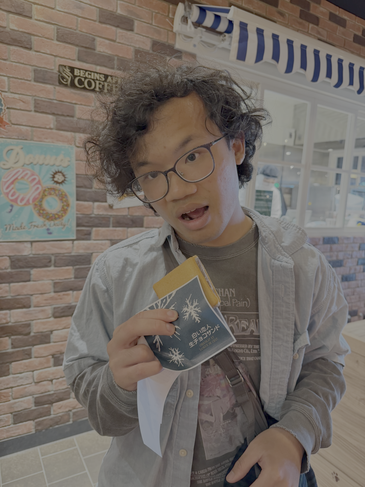
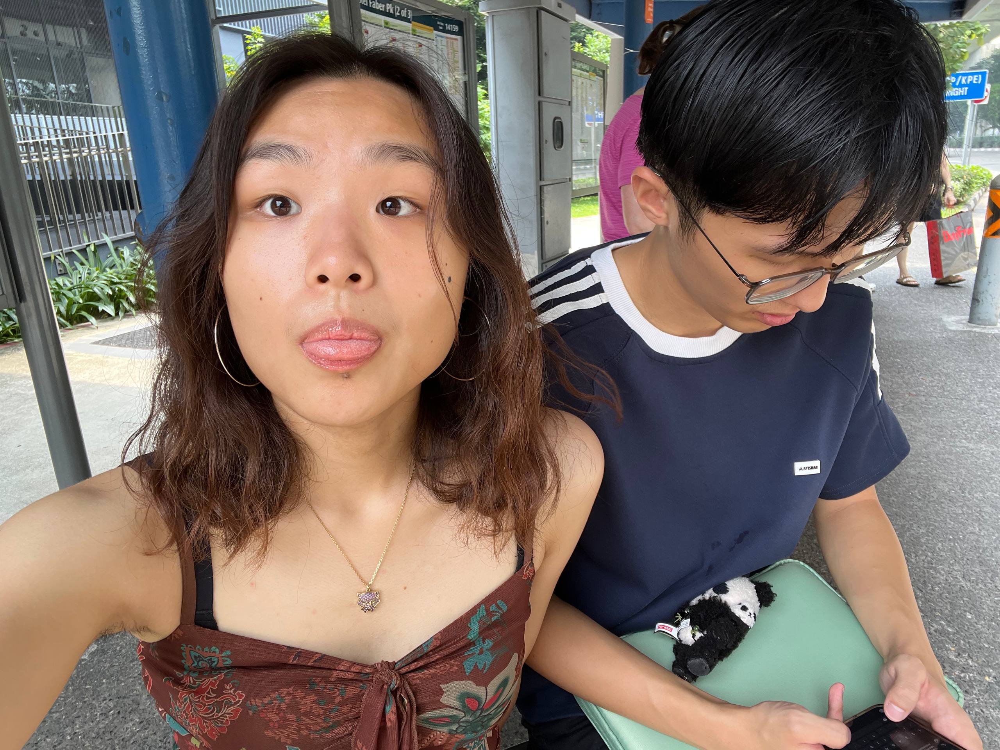
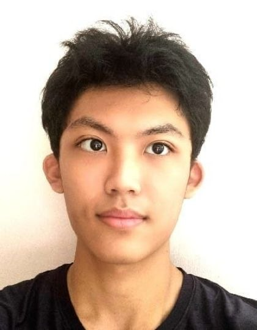

# About Us

We are a team based in the [School of Computing, National University of Singapore](http://www.comp.nus.edu.sg).

You can reach us at the email `seer[at]comp.nus.edu.sg`

## Project team

### Zhu Jiahang

[[github](https://github.com/kungfuxiongmao)]

* Role: Developer
* Responsibilities: Model

### Inchara Praveen

[[github](http://github.com/IncharaPraveen)]
[[portfolio](team/janejoe.md)]

* Role: Developer
* Responsibilities: UI

### Koh Luck Heng

[[github](http://github.com/lol-hi)]

[//]: # ([[portfolio]&#40;team/johndoe.md&#41;])

* Role: Developer
* Responsibilities: User Input Parsing

### Xinlin

[[github](https://github.com/headphonesribbons)] [portfolio]

* Role: Developer
* Responsibilities: Frontend

### He Ziyang

[[github](https://github.com/idkwattoput-689)]

* Role: Developer
* Responsibilities: Execution
